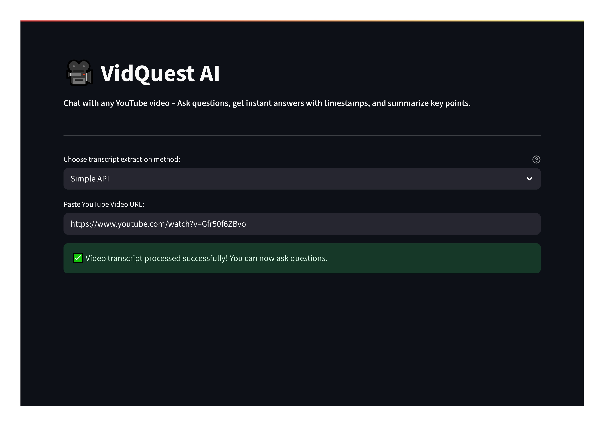
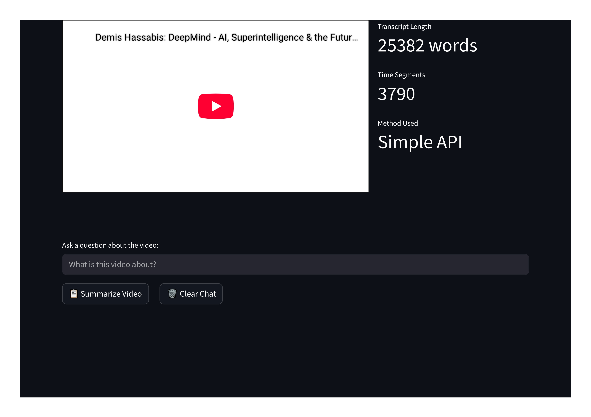
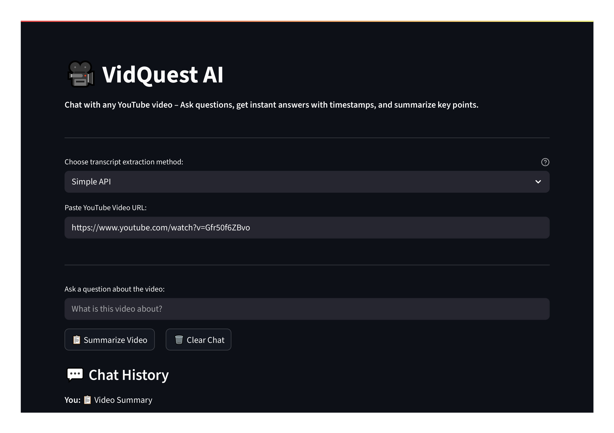
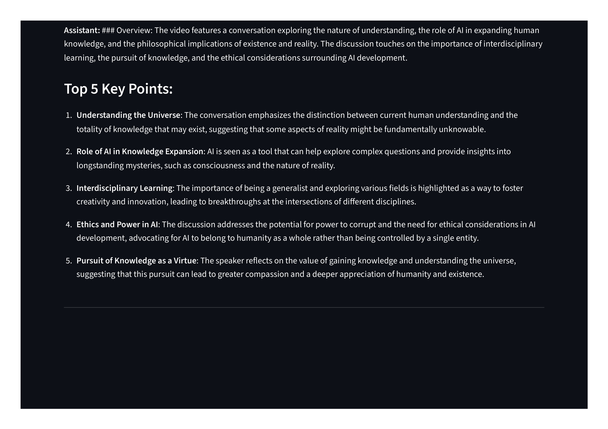

# 🎥 VidQuest AI – Chat with Any YouTube Video

A **Retrieval-Augmented Generation (RAG)** chatbot that lets you chat with any YouTube video using its transcript. Ask questions about video content and get intelligent responses with timestamp references!

## ✨ Why VidQuest AI?

Watching long videos just to find one key answer is time-consuming. VidQuest AI lets you:
✅ Ask natural questions and get instant answers
✅ Jump to the exact timestamp of the answer
✅ Get a quick summary with key points

Perfect for students, researchers, and curious minds who want fast insights from educational videos.

## ✨ Features

- 🎯 **Smart Q&A**: Ask natural language questions about any YouTube video
- ⏰ **Timestamp References**: Get exact timestamps for source material
- 📋 **Video Summarization**: Generate concise summaries with key points
- 🔍 **Semantic Search**: Find relevant content using AI-powered search
- 💬 **Chat Interface**: Interactive conversation with chat history
- 🎨 **Modern UI**: Clean, responsive design with dark theme

## 📷 App Demo

### 🔗 Home & Transcript Processing
<p align="center">
  
  
</p>

### 📋 Summary Generation
<p align="center">
  
  
</p>

## ✅ Live App

[](https://vidquest-ai-ws6tqnozr87mictkusab3c.streamlit.app/)

## 🚀 Quick Start

### 1. Clone & Install
```bash
git clone https://github.com/AyushDave30/VidQuest-AI.git
cd VidQuest-AI
pip install -r requirements.txt
```

### 2. Setup Environment
Create `.env` file:
```env
OPENAI_API_KEY=your_openai_api_key_here
```

### 3. Run Application
```bash
streamlit run app.py
```

## 📦 Requirements

```txt
streamlit>=1.28.0
openai>=1.3.0
langchain>=0.1.0
langchain-openai>=0.0.5
langchain-community>=0.0.10
youtube-transcript-api>=0.6.2
faiss-cpu>=1.7.4
python-dotenv>=1.0.0
yt-dlp>=2023.12.30
```

## 🎯 How to Use

1. **Enter YouTube URL**: Paste any YouTube video URL
2. **Wait for Processing**: App extracts and processes the transcript
3. **Ask Questions**: Type questions about the video content
4. **View Sources**: Click source buttons to see timestamp references
5. **Generate Summary**: Use summary button for key points overview

### Example Questions
- "What is this video about?"
- "What are the main points discussed?"
- "What examples are given?"
- "What conclusions does the speaker draw?"

## 🛠️ Technology Stack

- **Frontend**: Streamlit
- **LLM**: OpenAI GPT-4o-mini
- **Embeddings**: OpenAI text-embedding-3-small
- **Vector Store**: FAISS
- **Framework**: LangChain
- **Transcript**: youtube-transcript-api, yt-dlp

## 🚀 Deployment

### Streamlit Cloud (For Your Own Deployment)
1. Push code to GitHub
2. Connect to Streamlit Cloud
3. Add `OPENAI_API_KEY` in secrets
4. Deploy!

## 🐛 Troubleshooting

| Issue | Solution |
|-------|----------|
| "Transcript not available" | Try videos with captions (TED, Khan Academy) |
| OpenAI API errors | Check API key and account balance |
| FAISS installation issues | Use `pip install faiss-cpu --no-cache` |
| Memory issues | Try shorter videos or reduce chunk size |

## 📈 Performance

- **Processing Time**: 5-15 seconds per video
- **Memory Usage**: 200-500 MB
- **Supported Videos**: Any public YouTube video with captions

## 🎯 Supported Content

✅ **Works with:**
- Educational videos
- Tutorials and how-tos
- Interviews and talks
- Videos with closed captions

❌ **Doesn't work with:**
- Videos without captions
- Private/unlisted videos
- Music videos (no meaningful captions)

## 🔒 Privacy

- No data is stored permanently
- Transcripts processed in memory only
- API keys handled securely
- All data cleared when switching videos

## 🔮 Future Features

- [ ] Multi-language support
- [ ] Batch video processing
- [ ] Export chat history
- [ ] Voice input for questions
- [ ] YouTube playlist integration

## 🙏 Acknowledgments
- Inspired by [CampusX](https://www.youtube.com/@campusx-official) YouTube Channel
- Thanks to OpenAI, LangChain, and Streamlit

## 📞 Contact
Author: Ayush Dave
📧 Email: ayushdave1369@gmail.com

---

⭐ **Star this repo if you found it helpful!**
